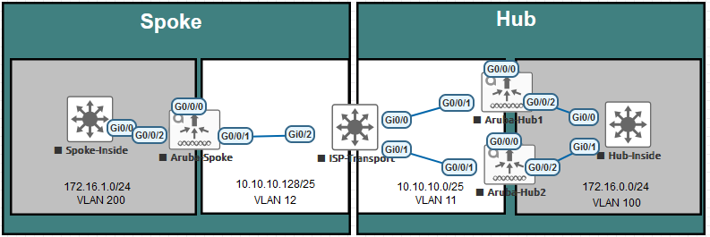

# Aruba Dual Hub with IPsec
For EveNG  

## Overview
Proof of concept for a spoke connecting to two hubs at the same site, over IPsec  

### Explanation
The spoke utilizes a loopback IP to form an IPsec tunnel (ipsec-map) to each spoke. The source and destination networks are a /32 to and from the loopbacks. Then, a GRE tunnel is built to/from each hub to the spoke. On the spoke, a tunnel-group is created with the two (or more) GREs inside; the order of the GRE tunnels dictate which tunnel is used first (pre-emption is enabled by default). Using an ACL, traffic is directed from the remote end to the GRE tunnel-group.  

Why use GRE tunnels? Because Aruba does not allow you to create two IPsec tunnels with the same subnet on the distant end (so in this case, we use a /32 of the loopback which are different on each distant end).  

## Licenses Needed  
Each spoke will need an AOS License for: Base License (MC-VA-XX), ACR (Advanced Cryptography), PEF (Policy Enforcement Firewall)  
The HUB will need an AOS License for: Base License (MC-VA-XX), TWO ACR (Advanced Cryptography) licenses, PEF (Policy Enforcement Firewall)  

## Topology
  

## Versions
Aruba = aruba-VMC-8.10.0.11-FIPS_89676  
ISP Transport & Clients = IOSv  

## User / Password
[removed]