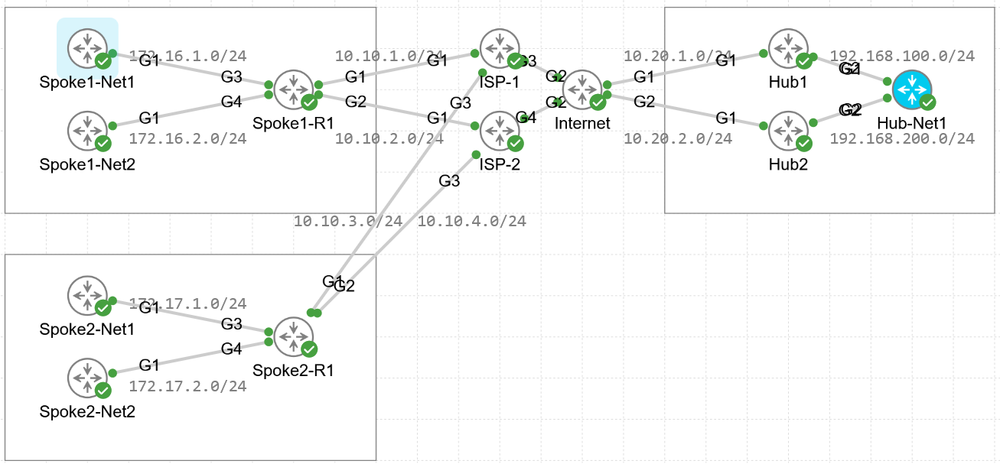

# FlexVPN with NHRP
For CML  

## Overview
Proof of concept for a spoke connecting to two hubs at the same site along with spoke to spoke via NHRP, over IPsec.  

## Licenses Needed  
Network-Advantage & DNA-Advantage  

## Topology
  

## Versions
C8000v = CML 17.9  

## User / Password
none  
