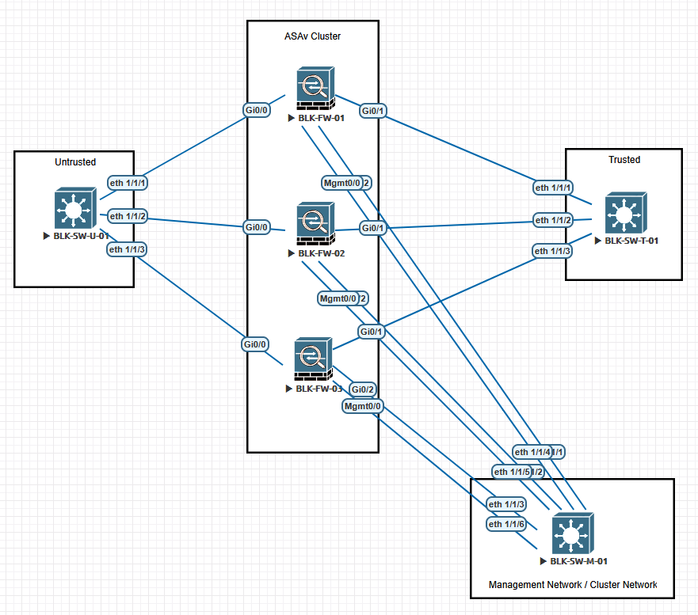

# ASAv_Clustering
For use with Eve-NG  

## Topology

## Lab Description
A very basic configuration for ASAv clustering. Note that this config is not 100% per the lab's topology, because it is an offline compilation of a test environment.  

## Static L3 ECMP w Interface Tracking
Per Cisco ASAv documentation, you need to do L3 PBR or ECMP to send traffic to the ASAv nodes. This was accomplished via Cisco 8000v, but these devices are not in this specific pictured topology (the configs remain as an example of what could be accomplished w a C8kv).  

### Software Versions
Dell Switches: OS10.5.5.4-193V with a virtualized 5248 image  
ASAv Firewalls: 9.18-356  
Cisco 8000v: 17.09.04a

### ASAv Notes
You will need to ensure that the ASAv is running with enough resources to satisfy the ASAv30 resource requirement, which is 4 CPU and 8GB RAM  

### ASAv Connections
ASAv GigabitEthernet0/0 - outside (Untrusted)  
ASAv GigabitEthernet0/1 - inside (Trusted)  
ASAv GigabitEthernet0/2 - Cluster Control Links (CCL) to Management  
ASAv Management0/0 - ASAv Management to Management  
