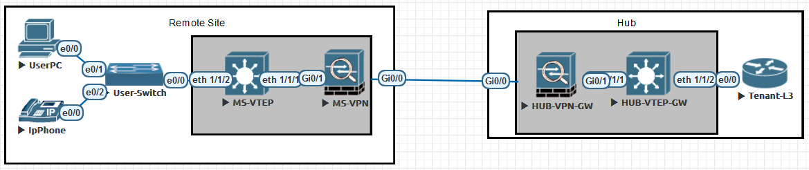

# Multisite L2 through VXLAN
For EveNG

## Overview
Proof of concept for extending L2 over a L3 IPSec VPN via VXLAN, utilizing Dell OS10.5 switches as the VTEP. ASAv for the VPN devices.

## Topology

